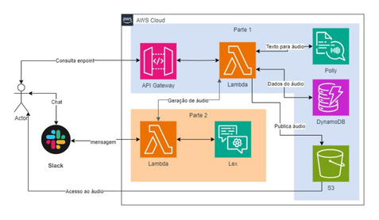

# Desenvolvimento da aplicação TTS (Text to Speech) com AWS Polly integrada a Amazon LEX Bot

## 👨‍💻👩‍💻 Projeto desenvolvido por: [Gabriel Trani](https://github.com/GaTrani), [José Pedro Cândido L.P.](https://github.com/PeterYouseph), [Rafael Torres Nantes](https://github.com/rafael-torres-nantes) e [Sarah Baraldi](https://github.com/mbaraldi-sarah).

## 📚 Contextualização do projeto

#### O projeto consiste em desenvolver uma aplicação que converta texto em áudio, utilizando a tecnologia *Text to Speech* (TTS) da Amazon Polly. A aplicação deve ser capaz de receber um texto, convertê-lo em áudio e disponibilizar o arquivo de áudio gerado em um *bucket* da AWS S3.

#### Além disso, compreende a criação de um *chatbot* utilizando a ferramenta da Amazon LEX e sua integração com a aplicação TTS citada anteriormente.

## 🖥️ Funcionamento do sistema

### Parte 1 - Text-to-Speech

Para transformarmos um texto em áudio, seguimos os seguintes passos:

1. Criamos um código *hash* para cada frase recebida da seguinte forma:

```bash
unique_id = hashlib.md5(phrase.encode()).hexdigest()
```

2. O *hash* serve para identificarmos se a frase já foi tranformado em áudio anteriormente. O *hash* foi utilizado com **identificador único** ao inserirmos o *log* no DynamoDB

```bash
log_item = {
    'id': unique_id, # Código hash
    'timestamp': datetime.utcnow().isoformat(),
    'phrase': phrase,
    'url_to_audio': s3_url
}
```

3. Caso a frase não tenha sido tranformada em .mp3, utilizanos o **Amazon Polly** para fazê-lo;

4. Armazenamos o o áudio em um *bucket* S3 e inserimos um *log* no DynamoDB, no padrão do citado no item 2;

### Parte 2 - ChatBot

Em nosso projeto, desenolvemos um *chatbot* que simula um pedido para uma **pizzaria**.

O *bot* é capaz de receber um pedido de uma pizza de 1 ou 2 sabores e uma bebida, anotar o endereço e o nome do cliente. Além disso, o pedido poderá ser cancelado pelo usuário.

A relação entre os *intents* e seus *slots* está descrita na tabela abaixo:

| Intent                 | Slots                                      |
|------------------------|-------------------------|
| saudacao               | nome                                       |
| escolher-pizza         | sabor1, sabor2, tamanhoPizza, tipoPizza                    |
| escolher-bebida        | opcaoBebida, saborBebida, tamanhoBebida                 |
| confirmar-pedido       | confirmarPedido, endereco                 |
| sobre                  | --                                         |
| FallbackIntent         | --              |
| NewIntent              | --              |

Sendo assim, o fluxo de conversa do *chatbot* se dá por:

1. **Saudação** -> onde coleta o **nome** do cliente.
2. **Tipo da pizza** -> onde o cliente informa se será de 1 ou 2 **sabores**.
    - Caso seja de 1 sabor: coleta o sabor. Segue para o passo 3.
    - Caso seja de 2 sabores: coleta o primeiro sabor e coleta o segundo. Segue para o passo 3.
3. **Tamanho pizza** -> onde o cliente informa se a pizza será **média** ou **grande**.
4. **Bebida** -> onde o cliente informa se quer ou não **bebida**.
    - Caso positivo, coleta o nome da bebida e segue para o passo 4.
    - Caso negativo, apenas segue para o passo 4.
5. **Endereço** -> onde coleta o **endereço** do cliente.
6. **Confirmação** -> onde o cliente pode ou não **cancelar** o pedido.

<!-- - Para todos os casos há opção para que as frases do bot sejam reproduzidas em áudio. Basta mandar no chat a mensagem "Frase". -->

### Parte 3 - API (Integração)

Utilizamos um serviço do **Serverless Framework**, declarado através do arquivo 'serverless.yml', que possui uma sintaxe simplificada para implantar infraestrutura na nuvem. Esse arquivo permite configurar funções **AWS Lambda**, a infraestrutura que aciona essas funções por meio de eventos, como tabelas de banco de dados AWS DynamoDB, *buckets* de armazenamento AWS S3, e receber solicitações HTTP e encaminhá-las para o AWS Lambda.

Os eventos são **gerenciados** por meio das funções do arquivo 'handler.py'.

A API é onde a **Parte 1** e a **Parte 2** se comunicam. Cada frase que o *chatbot* envia na conversa é transformada em áudio, para que o cliente tenha a opção de ouvir ao invés de ler o *bot*.

Em resumo, o fluxo da aplicação se dá da seguinte forma:



## 🛠️ Tecnologias/Ferramentas utilizadas

### Para a implementação do projeto, foram utilizadas as seguintes tecnologias/ferramentas:

#### Desenvolvimento da lógica da aplicação (*Backend* e *Frontend*):

##### Ferramentas para o desenvolvimento, versionamento e *deploy* do projeto:

[](https://code.visualstudio.com/)
[](https://git-scm.com/)
[](https://github.com/)
[](https://www.docker.com/)
[](https://aws.amazon.com/pt/)
[](https://aws.amazon.com/pt/cli/)
[](https://aws.amazon.com/pt/s3/)
[](https://aws.amazon.com/pt/cloudwatch/)
[](https://aws.amazon.com/pt/dynamodb/)
[](https://aws.amazon.com/pt/polly/)

##### Organização do Time:

[](https://trello.com/)
[](https://www.microsoft.com/pt-br/microsoft-teams/group-chat-software)

## 📁 Estrutura do projeto 

#### O projeto foi dividido nos seguintes diretórios, baseando-se no modelo MVC (Model-View-Controller) com devidas adaptações:

#### Divisão dos diretórios:

- ***controller →*** Realiza a chamada dos *services* (em ./services) criados para gerenciar os serviços AWS, sendo *bucket* na S3, banco de dados no DynamoDB e conversão de texto para áudio no Polly.

- ***services →*** Manipulam os serviços AWS criando tabelas e *buckets*, inserindo e alterando dados, convertendo texto para áudio utilizando Amazon Polly.

- ***bot-pizzaria-aws-LexJson →*** Contém as configurações usadas no *chatbot* criado no LEX.

- ***utils →*** Funções de utilidades geralmente usadas para checagem de autenticação com AWS, listagem de tabelas do DynamoDB e *buckets* do S3 e políticas do IAM.

#### Outros arquivos importantes:

- ***handler.py →*** Contém as funções que sintetizam a API. Verifica a saúde da API, recebe a frase e retorna o áudio gerado pelo Polly, salva o arquivo .mp3 no *bucket* S3, cadastra os logs no DynamoDB.

- ***serverless.yml →*** Contém uma sintaxe simplificada para implantar infraestrutura AWS Lambda. Define as políticas IAM e as requisições que serão usadas no *handler.py*.

## 📎 Diagrama de atividades da aplicação
### Fluxo de funcionamento e consumo da API 

## 📌 Como executar o projeto

### Clone o repositório

```bash
$ git clone https://github.com/Compass-pb-aws-2024-MARCO/sprints-6-7-pb-aws-marco.git
```

### Acesse a pasta do projeto no terminal/cmd:

```bash
$ cd sprints-6-7-pb-aws-marco
```

### Realize um check-out para a branch de desenvolvimento:

```bash
$ git checkout equipe-9
```

### Cerfitique-se ue tem o serverless instalado:

```bash
$ serverless
```

### Caso não estiver, instale poe meio do comando:

```bash
$ npm install -g serverless
```

### Instale os plugins do serverless:

```bash
$ npm install serverless-python-requirements serverless-dotenv-plugin
```

### Configure as credenciais da aws:

```bash
$ aws configure
```

### Faça login no serverless:

```bash
$ serverless login
```

### Faça deploy dos lambdas na aws:

```bash
$ serverless deploy
```

### Utilizando o Amazon LEX:

1. Abra o Amazon LEX da aws. 
2. Em **bots**, clique em **Actions** e importe a pasta **bot-pizzaria-aws-LexJson**, em seguida clique **build**.

No Lambda da AWS, crie um arquivo lambda com o
```bash
import json
import requests

def lambda_handler(event, context):
    print("Received event: " + json.dumps(event))
    
    # Obtém a frase do slot "Phrase"
    phrase = event['currentIntent']['slots'].get('PhraseSlot-Saudacao')
    print("Frase TTS: " + str(phrase))
    
    # Se a frase não for encontrada, retorna uma mensagem apropriada
    if phrase is None:
        response = {
            "dialogAction": {
                "type": "Close",
                "fulfillmentState": "Failed",
                "message": {
                    "contentType": "PlainText",
                    "content": "Desculpe, não consegui encontrar a frase na sua solicitação."
                }
            }
        }
        print("Response: " + json.dumps(response))
        return response

    # Define a URL da API
    api_url = "https://k84x0cd1xf.execute-api.us-east-1.amazonaws.com/dev/v1/tts"
    try:
        # Define os cabeçalhos da requisição
        headers = {"Content-Type": "application/json"}
        
        # Faz a requisição POST para a API com os dados corretos
        response = requests.post(api_url, headers=headers, json={"phrase": phrase})
        print("HTTP Response Status Code: " + str(response.status_code))
        print("HTTP Response Text: " + response.text)

        if response.status_code == 200:
            data = response.json()
            audio_url = data.get('url_to_audio')
            if audio_url:
                message = f"Aqui está o áudio da sua mensagem: {audio_url}"
            else:
                message = "Desculpe, não consegui obter o URL do áudio."
        else:
            message = f"Desculpe, ocorreu um erro na solicitação. Status code: {response.status_code}"
    
    except requests.exceptions.RequestException as e:
        message = f"Erro na requisição HTTP: {str(e)}"
        print("Exception: " + str(e))

    # Retorna a resposta final para o Lex
    response = {
        "dialogAction": {
            "type": "Close",
            "fulfillmentState": "Fulfilled",
            "message": {
                "contentType": "PlainText",
                "content": message
            }
        }
    }
    print("Response: " + json.dumps(response))
    return response
```


## 🤯 Dificuldades encontradas 

### Dificuldades técnicas

Durante o desenvolvimento do chatbot, cada alteração no código exigia um tempo excessivo para ser compilada pelo Amazon LEX. Essa lentidão impedia um fluxo de trabalho ágil e eficiente, atrasando o desenvolvimento e a testagem do chatbot.

<!-- Além disso, houve grande dificuldade em fazer a comunicação do chatbot com o TTS. Foi superada fazendo tchiriri tcharara -->

-------
### Dificuldades de organização

O término do semestre letivo, com seu acúmulo significativo de atividades acadêmicas, impactou diretamente o andamento do projeto, ocasionando atrasos no desenvolvimento e na resolução de problemas. Essa sobrecarga de compromissos por parte da equipe afetou o cronograma original.